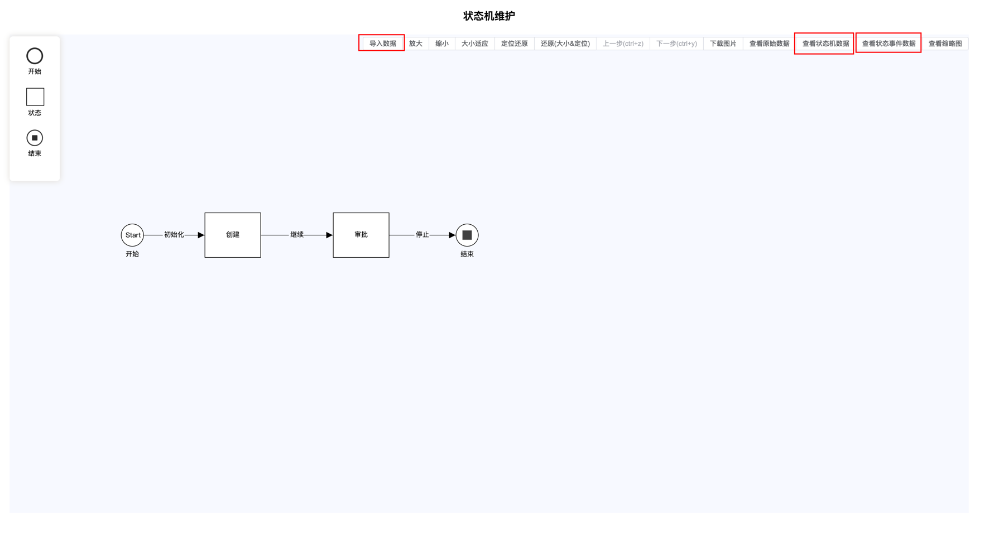

<p align="center">
  
</p>

<h1 align="center">State Machine Template Factory</h1>

<p align="center">
  可视化状态机设计器 · 拖拽生成状态流转图 · 一键导出 Java 代码模板
</p>

<p align="center">
  <a href="README-En.md">English</a> | 中文
</p>

<p align="center">
  <a href="https://github.com/boommanpro/state-machine-template-factory/releases"></a>
  <a href="LICENSE"></a>
  <a href="https://github.com/boommanpro/state-machine-template-factory/actions"></a>
  
  
  
</p>

---

## 项目介绍

`State Machine Template Factory` 是一个可视化状态机设计器，用于解决业务系统中状态流转难以维护、状态值随意 `set`、产研沟通成本高等问题。

在业务开发中，状态变更常见的实现方案有 ① 分支法 ② 查表法 ③ 状态机。当工程逻辑复杂时，状态流转往往稀里糊涂、工程状态随意 `set`。本项目提供了一套可视化的解决方案：**产研沟通后输出流程图，流程图可一键转化为 Java 代码模板，避免工程中出现魔法值**。

### 解决了什么问题

抽象看，状态变更涉及以下内容：

1. **状态** - 当前状态、目标状态
2. **事件** - 用于触发当前状态到目标状态流转
3. **流转条件（Condition）**
4. **流转动作（Action）**

期望的工程形态：

- 产研沟通后输出流程图，即数据存储什么状态、在哪些动作触发状态 A→B
- 流程图可转化为 Java 代码、枚举值，避免在工程中有魔法值
- 流程图哪些状态可变更应动态化，基于配置中心或配置文件，即创建状态机支持文件配置而非硬编码
- 状态机变更支持输出 PlantUML，方便大模型支持
- 状态机的流转可记录，前端可快速展示
- 增强：支持以 key 维度的多版本控制，存在历史状态机时走完历史流程

## 项目截图



## 在线演示

部署在 GitHub Pages：<https://boommanpro.github.io/state-machine-template-factory/>

## 核心特性

- **可视化拖拽设计** - 基于 [LogicFlow](https://site.logic-flow.cn/) 实现状态机节点的拖拽编排
- **多类型节点** - 内置开始、结束、任务、推送、用户、时间、点击、下载等多种节点类型
- **状态与事件管理** - 可视化管理状态机中的状态与事件
- **JSON 配置驱动** - 状态机以 JSON 文件配置，支持非硬编码创建
- **Java 代码模板导出** - 根据 `package-name` 等参数生成 Java 代码模板
- **PlantUML 导出** - 支持导出 PlantUML，方便与大模型协作
- **基于 COLA 状态机框架** - 后端复用阿里巴巴 COLA State Machine 实现

## 技术栈

| 模块 | 技术 |
| --- | --- |
| 后端 | Java 1.8 · Spring Boot 2.7.14 · COLA State Machine · Lombok · Fastjson2 |
| 前端 | Vue 3 · Vite 5 · LogicFlow · Element Plus · Vue Router · Vue JSON Pretty |

## 项目结构

```
state-machine-template-factory/
├── src/                                  # Java 后端
│   └── main/java/
│       ├── com/alibaba/cola/statemachine/  # COLA 状态机框架
│       └── com/boommanpro/statemachine/   # 模板工厂应用
├── ui/                                   # Vue 3 前端
│   ├── src/
│   │   ├── components/                   # LF 组件、注册节点、属性配置
│   │   ├── App.vue
│   │   └── main.js
│   ├── vite.config.js
│   └── package.json
├── docs/                                 # GitHub Pages 部署产物
└── pom.xml
```

## 快速开始

### 环境要求

- Node.js >= 16
- Java 1.8（如需运行后端）
- Maven 3（如需构建后端）

### 前端开发

```bash
cd ui
npm install
npm run dev
```

浏览器访问 <http://localhost:5173>

### 前端构建

```bash
cd ui
npm install
npm run build
```

构建产物输出到 `ui/dist`，由于 `vite.config.js` 已配置 `base: './'`，可直接用于 GitHub Pages 部署。

### 后端运行（可选）

```bash
mvn spring-boot:run
```

### 示例

项目内置订单状态机示例，位于 `src/test/resources/instance/demo/`：

- `orderTransition.json` - 状态流转配置
- `orderTransitionGraphData.json` - 图数据

## 部署方式

### GitHub Pages（自动部署）

项目已配置 GitHub Actions 工作流（`.github/workflows/deploy.yml`），当推送到 `main` 分支时自动构建 `ui/` 并部署到 GitHub Pages。

手动部署流程：

1. 进入仓库 **Settings → Pages**
2. **Source** 选择 `GitHub Actions`
3. 推送代码到 `main` 分支即可触发自动部署

### 手动部署

```bash
cd ui
npm install
npm run build
# 将 dist 目录内容部署到任意静态服务器
```

## 贡献

欢迎提交 PR 贡献代码。当前 MVP 已完成，管理端部分仍待完善：

- 状态机生成器增删改查系统
- 以状态机名称为 key 的版本管理与差异判断
- 拖拉拽生成能力增强
- 基于 `package-name` 等参数生成模板 Java 代码

## 许可证

[MIT License](LICENSE)
